# Arca Architecture

This document describes the internal architecture of Arca, a Docker Engine API implementation backed by Apple's Containerization framework.

## System Overview

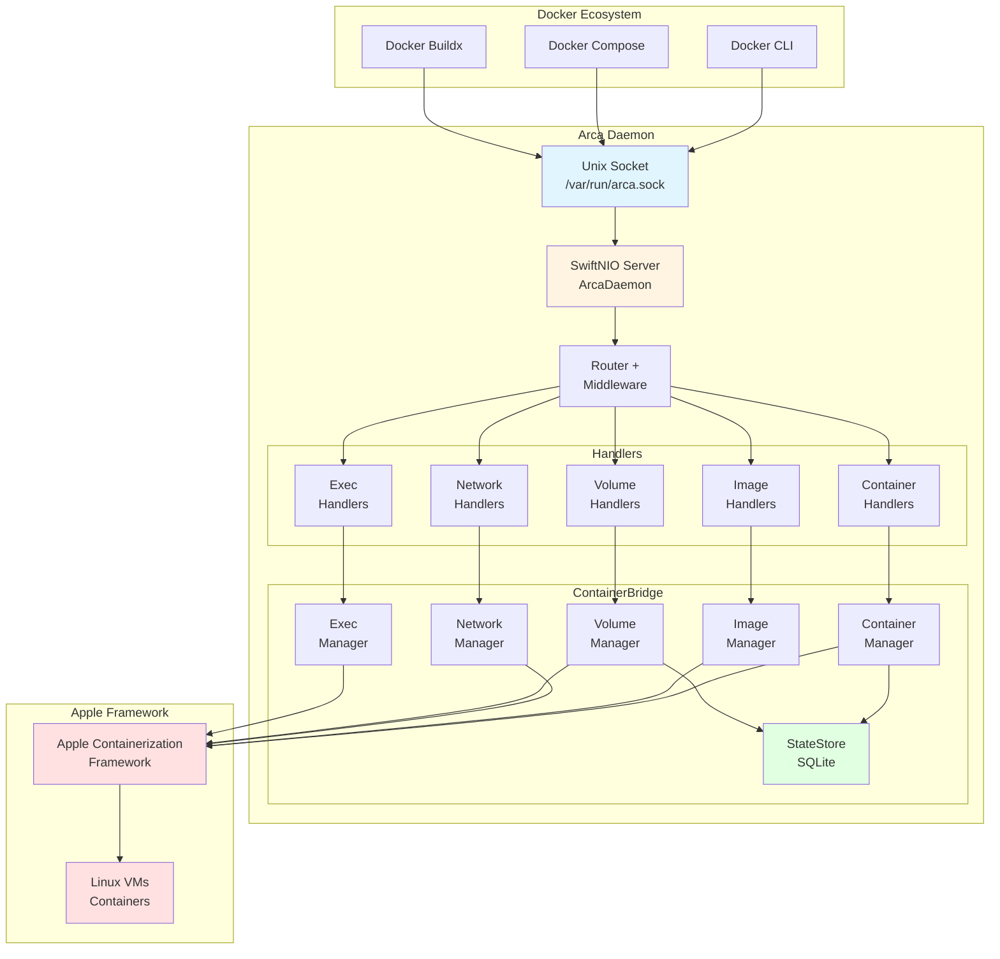

## Module Structure

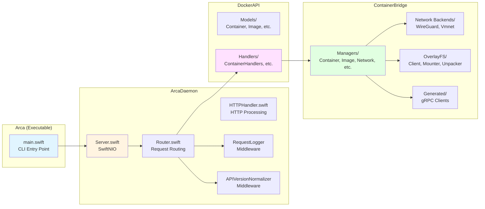

## Request Flow

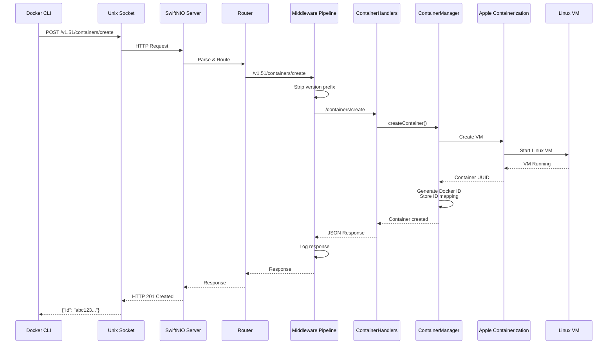

## Networking Architecture

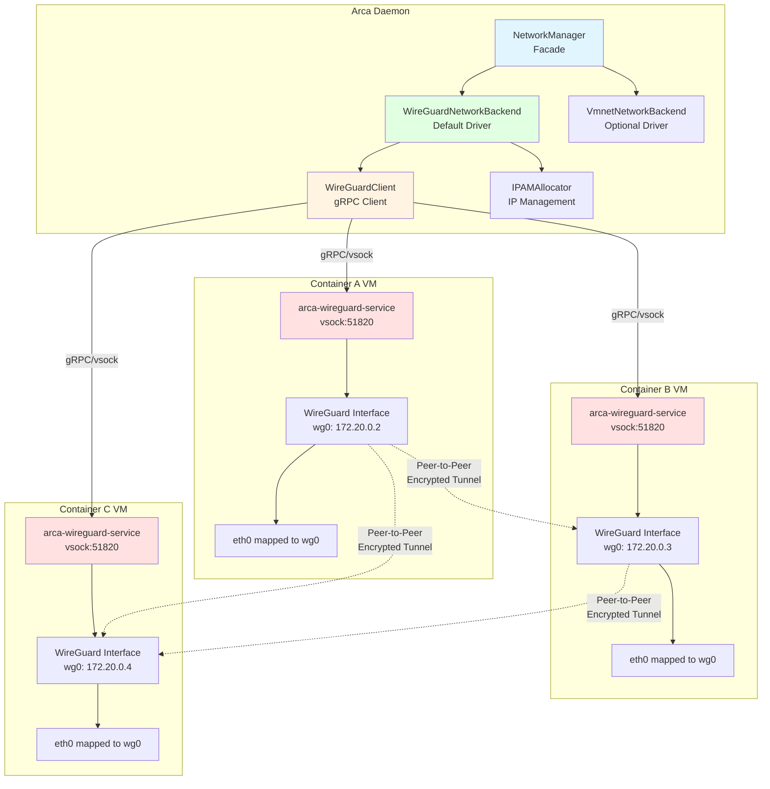

### WireGuard Full Mesh Topology

Each container on a network has WireGuard peers to all other containers on that network:

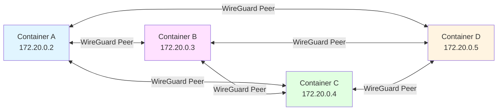

## Volume Architecture

```mermaid
graph TB
    subgraph "Arca Daemon"
        VM[VolumeManager]
        SS[StateStore<br/>SQLite]
    end

    subgraph "Volume Storage ~/.arca/volumes/"
        LocalVol[mydata/<br/>├── data/<br/>│   └── files]
        BlockVol[mydb/<br/>├── volume.img<br/>   EXT4 filesystem]
    end

    subgraph "Container VM"
        subgraph "VirtioFS Shares"
            BindMount[/host-data<br/>macOS directory]
            LocalMount[/app-data<br/>~/.arca/volumes/mydata/data]
        end

        subgraph "Block Device"
            BlockMount[/var/lib/db<br/>EXT4 block device]
        end
    end

    VM -->|Manages| LocalVol
    VM -->|Manages| BlockVol
    VM -->|Metadata| SS

    LocalVol -.->|VirtioFS| LocalMount
    BlockVol -.->|EXT4 Mount| BlockMount

    style VM fill:#e1f5ff
    style SS fill:#e1ffe1
    style LocalVol fill:#fff4e1
    style BlockVol fill:#ffe1ff
    style BindMount fill:#e1ffe1
    style LocalMount fill:#fff4e1
    style BlockMount fill:#ffe1ff
```

### Volume Driver Comparison

| Feature | Local Driver (Default) | Block Driver (Optional) |
|---------|----------------------|------------------------|
| **Storage** | VirtioFS directory | EXT4 block device |
| **Location** | `~/.arca/volumes/{name}/data/` | `~/.arca/volumes/{name}/volume.img` |
| **Sharing** | ✅ Multiple containers | ❌ Exclusive access |
| **Use Case** | General purpose | Databases, high I/O |
| **Performance** | Good | Better for heavy I/O |
| **Creation** | `docker volume create mydata` | `docker volume create --driver block mydata` |

## Container Persistence

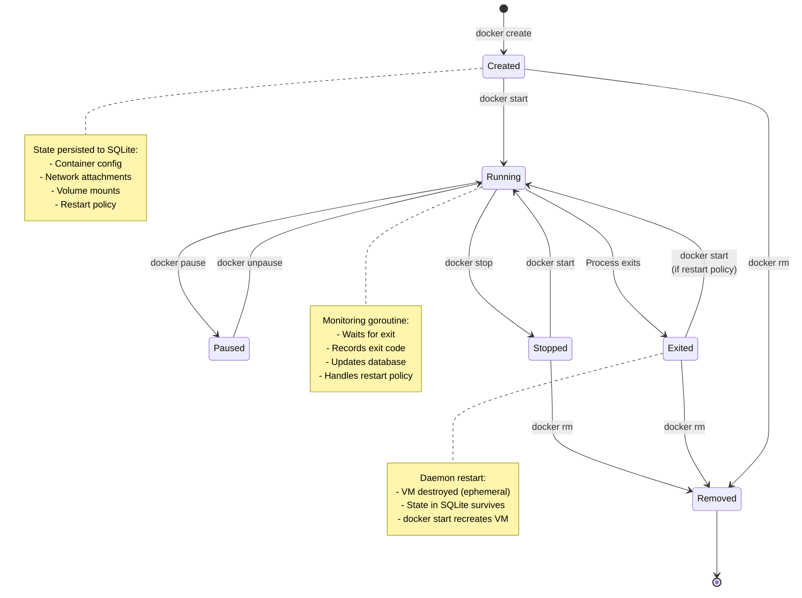

### Restart Policy Behavior

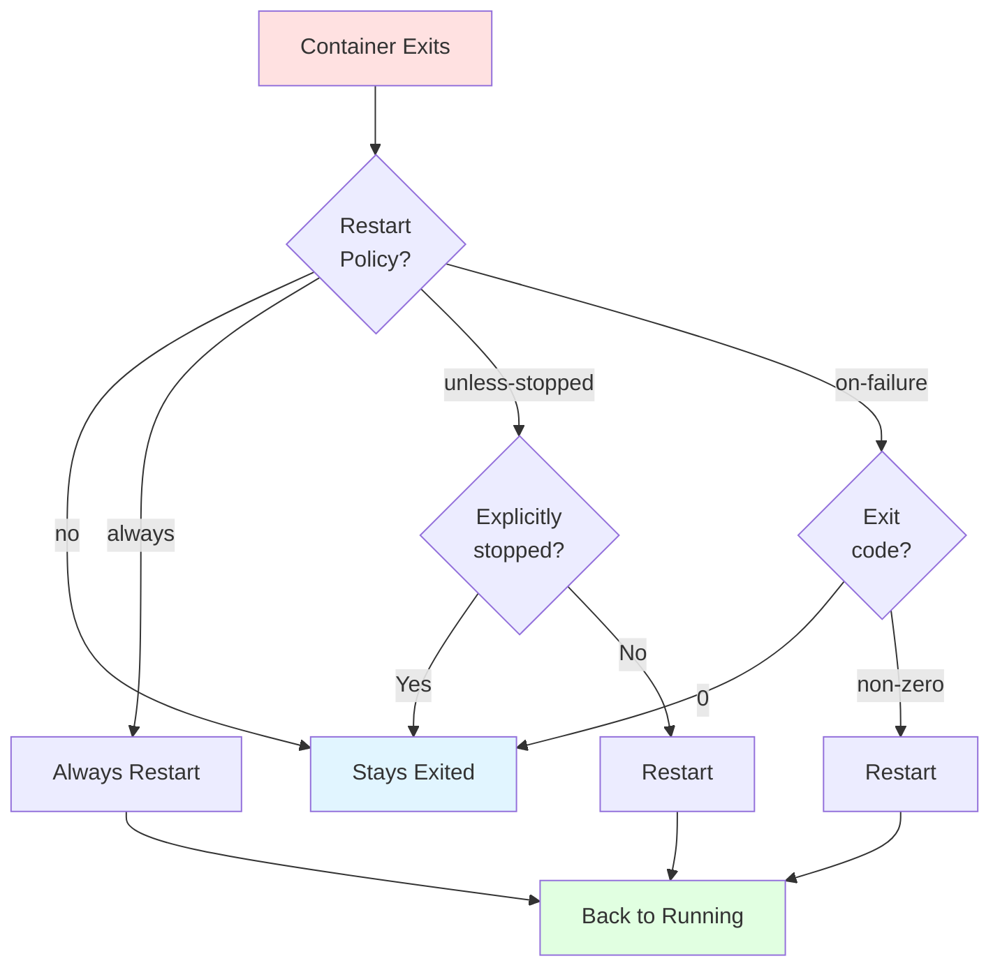

## Image Management

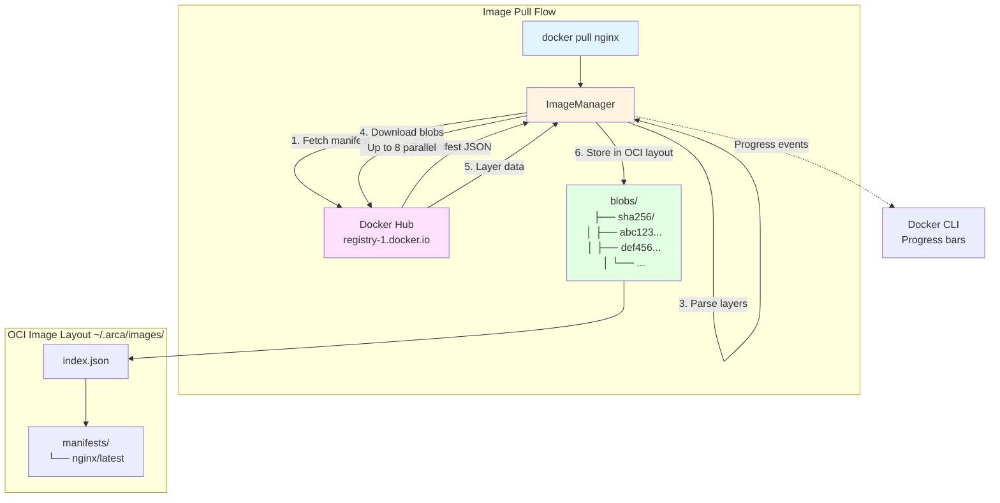

### Image Progress Reporting

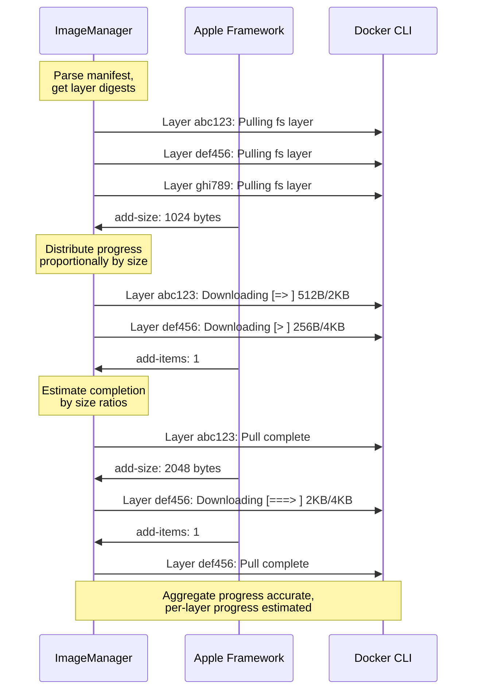

## Container Lifecycle Integration

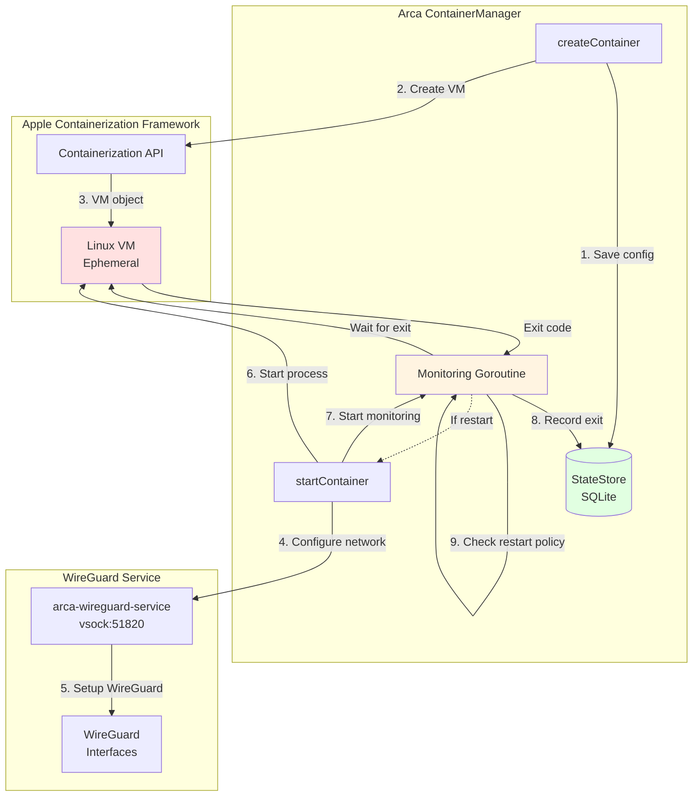

## vminitd Custom Fork

```mermaid
graph TB
    subgraph "Arca Repository"
        Submodule[containerization/<br/>Git Submodule]
    end

    subgraph "arca-vminitd Fork"
        Upstream[Apple's upstream<br/>containerization repo]
        Extensions[vminitd/extensions/<br/>Arca-specific code]

        subgraph "Extensions"
            WG[wireguard-service/<br/>WireGuard management]
            FS[filesystem-service/<br/>OverlayFS operations]
        end
    end

    subgraph "Built vminit:latest Image ~/.arca/vminit/"
        Binary[/sbin/vminitd<br/>PID 1 in containers]
        WGBin[/usr/local/bin/<br/>arca-wireguard-service]
        FSBin[/usr/local/bin/<br/>arca-filesystem-service]
    end

    Submodule -.->|Points to| Upstream
    Submodule --> Extensions

    Extensions --> WG
    Extensions --> FS

    WG -->|Built into| WGBin
    FS -->|Built into| FSBin
    Upstream -->|Built into| Binary

    Binary -.->|Runs| WGBin
    Binary -.->|Runs| FSBin

    style Submodule fill:#e1f5ff
    style Extensions fill:#fff4e1
    style WG fill:#ffe1ff
    style FS fill:#ffe1ff
    style Binary fill:#e1ffe1
```

## HTTP Streaming

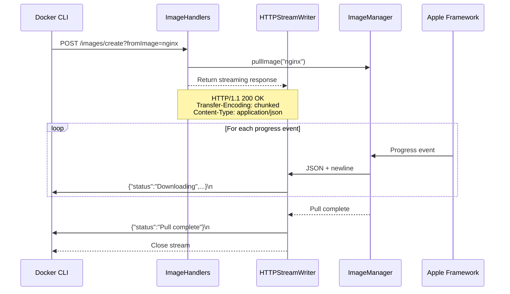

## Code Signing & Entitlements

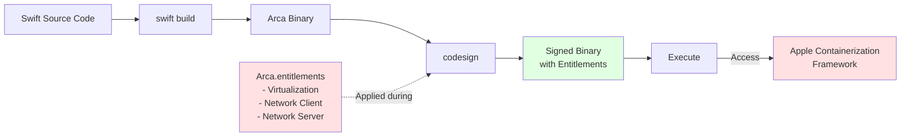

## Performance Characteristics

| Component | Metric | Value | Notes |
|-----------|--------|-------|-------|
| **Container Startup** | Time | 1-3 seconds | VM initialization overhead |
| **Memory per Container** | RAM | 50-100 MB | VM overhead vs namespace isolation |
| **Network Latency** | WireGuard | ~1 ms | Peer-to-peer tunnels |
| **Network Latency** | vmnet | ~0.5 ms | Native Apple networking |
| **Image Pull** | Parallelism | 8 concurrent | Apple's parallel downloader |
| **Image Storage** | Type | Content-addressable | Layer deduplication |

## Key Design Decisions

### 1. WireGuard for Default Networking
**Why?** Full Docker API compatibility, dynamic network operations, multi-network support
**Trade-off:** Slightly higher latency (~1ms vs ~0.5ms for vmnet) but much more flexible

### 2. Container Persistence via SQLite
**Why?** Containers survive daemon restarts, Docker-compatible behavior
**Trade-off:** Added complexity, database maintenance

### 3. VirtioFS for Default Volumes
**Why?** Simple, reliable, shareable across containers
**Trade-off:** Some filesystem features limited vs native Linux

### 4. Buildx Integration (Not Custom Build API)
**Why?** Full feature coverage, zero maintenance, future-proof
**Trade-off:** Requires buildx installed, can't customize build internals

### 5. VM per Container (Apple's Model)
**Why?** Strong isolation, required by Apple's framework
**Trade-off:** Higher resource usage vs namespace-based containers

## Development Architecture

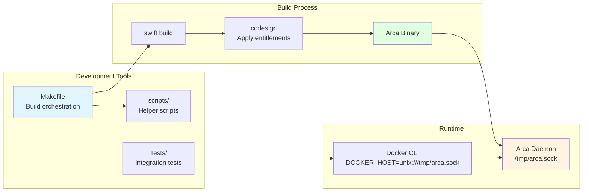

---

For more information, see:
- **OVERVIEW.md** - High-level project introduction
- **LIMITATIONS.md** - Known differences from Docker
- **Source code** - `Sources/` directories with inline documentation
