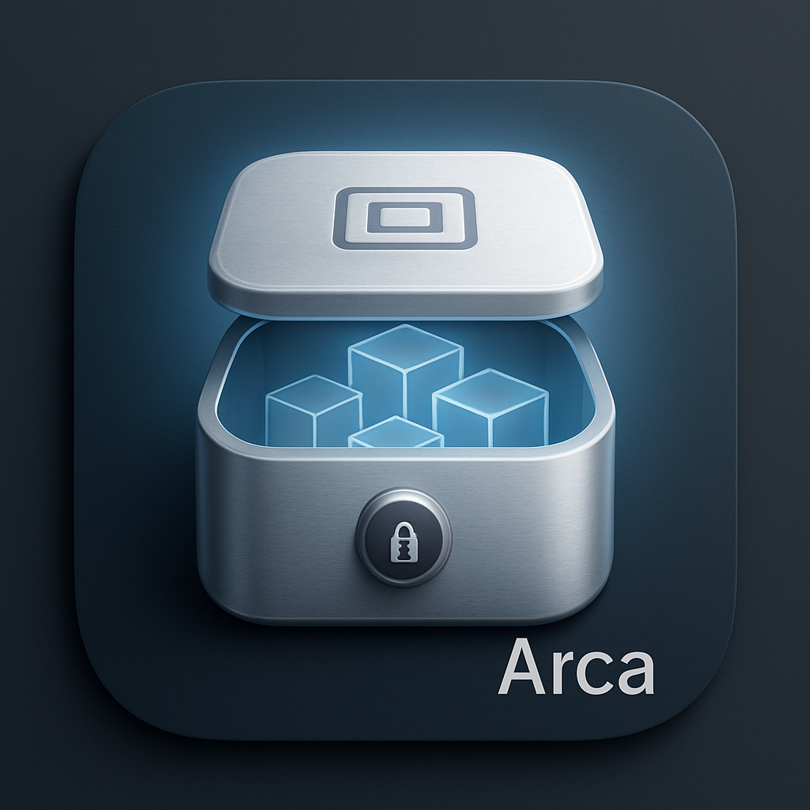

<p align="center">
  
</p>

# Arca

**Docker compatible, Apple native, secure container engine for macOS**

Arca is a complete container runtime built on Apple's Virtualization framework. It provides Docker CLI compatibility while leveraging macOS's native VM-per-container architecture for security and performance.

Part of the [Vas Solutus](https://vassolutus.com) project - freeing containers on macOS.

## Features

- Docker CLI and Docker Compose compatibility
- Secure native Apple Silicon performance utilizing a lightweight virtual machine per container
- Encrypted WireGuard-based networking with multi-network support
- Container name DNS resolution
- Named volumes and bind mounts

## Installation

### Prerequisites
macOS 26.0+ (Tahoe) with Apple Silicon (M1+)
_May work on macOS 15.0+ (Sequoia) with Apple Silicon._

Install the Docker CLI tools via Homebrew:

```bash
brew install docker docker-buildx docker-compose
```

### Install Arca

Download the latest `.dmg` from [Releases](https://github.com/Vas-Solutus/arca/releases) and drag Arca to your Applications folder.

The `.dmg` includes:
- Pre-built Linux kernel and vminit (no manual setup required)
- Auto-starts daemon on boot via LaunchAgent
- Code-signed and notarized for macOS Gatekeeper

### Configure Your Shell

```bash
# Add to your shell profile (~/.zshrc or ~/.bashrc)
export DOCKER_HOST=unix://~/.arca/arca.sock

# Apply immediately
source ~/.zshrc

# Verify it works
docker run hello-world
```

## Limitations & Differences

Arca aims for Docker compatibility but has some important differences due to its VM-per-container architecture.

### Networking

| Feature | Docker | Arca |
|---------|--------|------|
| `bridge` network | Linux bridge + veth pairs | WireGuard mesh (~1ms latency) |
| `host` network | Shares host network namespace | vmnet NAT (host routable IP) |
| `docker network connect` | Supported | Supported (WireGuard only) |
| Multi-network containers | Supported | Supported (WireGuard only) |
| Container DNS | 127.0.0.11 | 127.0.0.11 (embedded DNS) |

**Key differences:**
- The default `bridge` network uses WireGuard mesh instead of Linux bridges. This provides encryption but with slightly higher latency (~1ms vs ~0.1ms).
- The `host` network mode uses Apple's vmnet framework with NAT. Containers get their own IP address rather than sharing the host's network stack. This means `localhost` inside the container refers to the container, not the host.
- To access host services from a container, use `host.docker.internal`.

### Docker Build

- **Only `docker-container` driver works** - The default `docker` driver requires direct filesystem access which isn't available with VM-per-container.
- **First build may fail** - When buildx auto-creates a new builder container, there's a timing issue where the build starts before the container is fully ready. Simply retry the build.

### Volumes

- **Bind mounts** use VirtioFS, which has some behavioral differences from native Linux bind mounts (e.g., inotify events may differ).
- **Named volumes** support two drivers:
  - `local` - VirtioFS-based, can be shared between containers
  - `block` - EXT4 block device, better I/O performance for databases and build caches

**Block driver** (`docker volume create --driver block myvolume`):
- Significantly faster I/O than VirtioFS (native EXT4 performance)
- Ideal for databases, build caches, and I/O heavy workloads
- **Limitations:**
  - Exclusive access only - cannot be shared between running containers
  - Must be attached at container start (no hot mounting)
  - Default size 512GB (sparse file - only uses disk space as data is written)

### Not Supported

- Swarm mode
- Privileged containers (all containers run in isolated VMs)
- Native Linux cgroups (resource limits are applied at VM level)

### Known Issues

- **Image sizes** show compressed (OCI blob) sizes rather than uncompressed sizes
- **Short-lived containers** (<1-2s) may not persist exit codes correctly if daemon crashes immediately after

## Development

For contributors who want to build Arca from source.

### Clone and Setup

```bash
# Clone repository with submodules
git clone --recurse-submodules https://github.com/Vas-Solutus/arca.git
cd arca
```

### Install Swift Linux SDK and Build vminit

```bash
# One-time setup (~5 minutes)
cd containerization
make cross-prep  # Install Swift Static Linux SDK
cd ..
make vminit      # Build vminit:latest with networking extensions
```

### Build and Run

```bash
# Build and run daemon (uses /tmp/arca.sock for development)
make run

# In another terminal
export DOCKER_HOST=unix:///tmp/arca.sock
docker run -d nginx:latest
docker ps
```

### Other Commands

```bash
make              # Debug build with entitlements
make release      # Release build
make test         # Run tests
make install      # Install to /usr/local/bin
```

## Architecture

- **VM-per-container**: Each container runs in its own lightweight VM via Apple's Virtualization framework
- **WireGuard Networking**: Full mesh peer-to-peer encrypted networking between containers
- **Custom vminitd**: Extended Apple's init system with gRPC APIs for network and filesystem control
- **SQLite Persistence**: Container state survives daemon restarts

## Documentation

- [ARCHITECTURE.md](Documentation/ARCHITECTURE.md) - Technical deep-dive
- [DISTRIBUTION.md](Documentation/DISTRIBUTION.md) - Build and release process
- [VMINIT_BUILD.md](Documentation/VMINIT_BUILD.md) - Building custom vminit

## License

[AGPL-3.0](LICENSE)